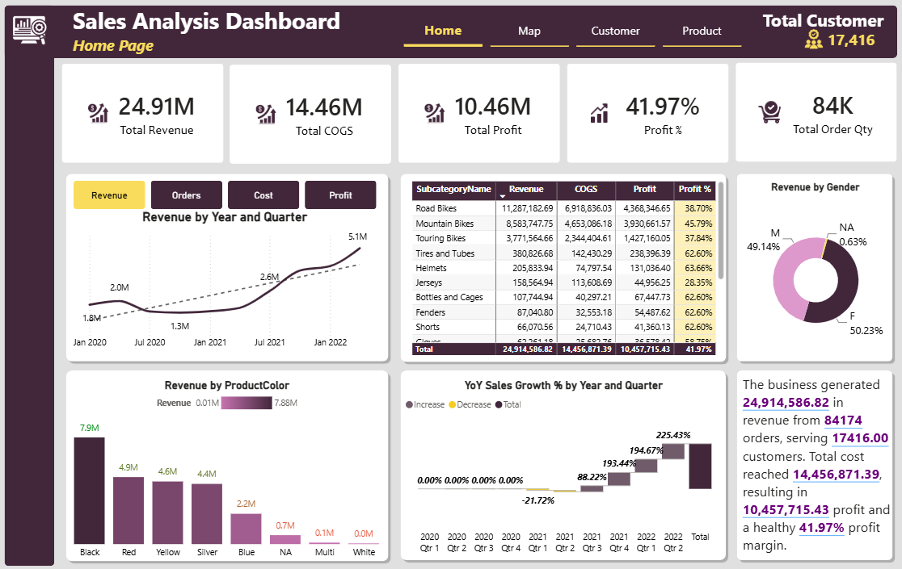
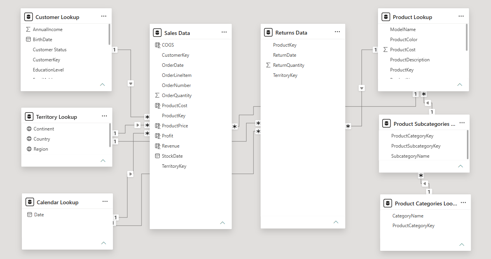
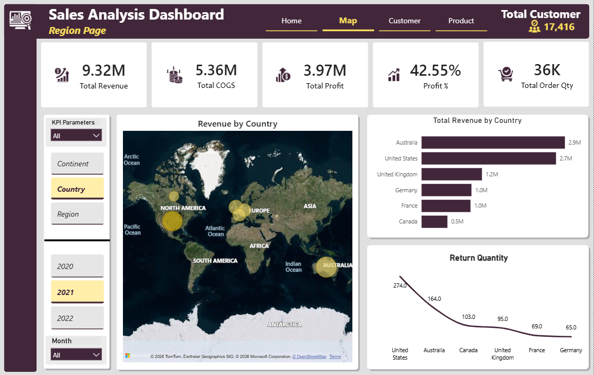
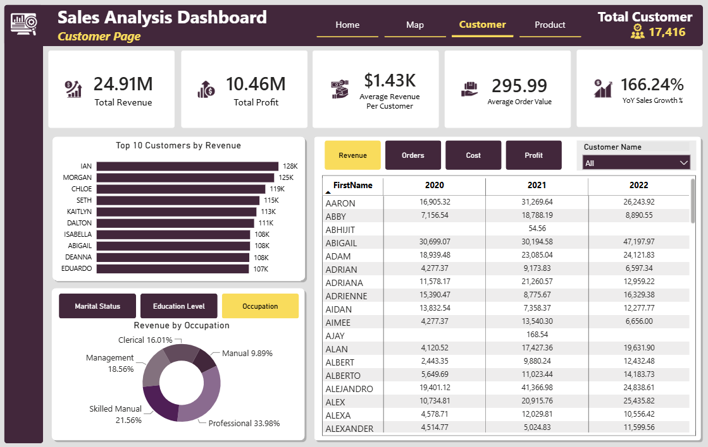
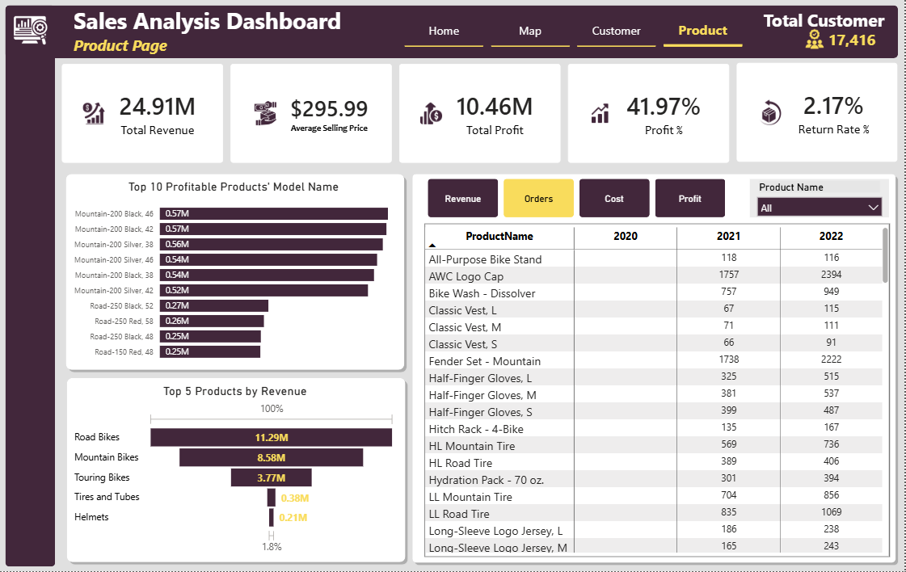

# AdventureWorks Sales Analysis using Power BI

An end-to-end Business Intelligence project that transforms raw AdventureWorks sales data into interactive dashboards using Power Query, Data Modeling, DAX, and Time Intelligence.

---

# Dashboard Preview

---

# Project Overview

This project demonstrates the complete Power BI analytics workflow, from raw data preparation to interactive business reporting.

### Objectives

- Transform raw sales data into an analytical model
- Build a scalable star schema
- Develop reusable DAX measures
- Apply Time Intelligence calculations
- Design interactive dashboards
- Generate actionable business insights

---

# Business Problem

Business data is often spread across multiple tables, making it difficult to monitor performance and identify trends efficiently.

This project consolidates sales, customer, product, and geography data into a centralized reporting solution that enables decision-makers to analyze performance through interactive dashboards.

---

# Tools & Technologies

- Microsoft Power BI Desktop
- Power Query
- DAX
- Data Modeling

---

# Project Workflow

---

# Dataset

**Dataset:** Microsoft AdventureWorks

The dataset contains information related to:

- Sales
- Customers
- Products
- Product Categories
- Geography
- Calendar
- Product Returns

---

# Data Preparation (Power Query)

Power Query was used to clean, transform, and prepare the data before analysis.

### Tasks Performed

- Appended data from multiple tables
- Merged lookup tables
- Created a dynamic calendar table
- Added custom columns
- Created conditional columns
- Corrected data types
- Prepared data for analytical modeling

### "images" folder provides a snapshot of this section

---

# Data Modeling

Mostly star schema was implemented to improve report performance and simplify analytical calculations.

### Model Highlights

- Fact table and dimension tables
- One-to-many relationships
- Calendar table integration
- Optimized filtering across the model

---

# DAX Development

Business metrics were developed using DAX to support dynamic reporting and analysis.

### Core KPIs

- Total Revenue
- Total COGS
- Total Profit
- Profit %
- Total Order Quantity

### Time Intelligence

- Previous Year Sales
- Year-over-Year Growth
- Year-to-Date calculations

### DAX Features

- Measures
- Variables (VAR)
- RELATED
- DIVIDE
- IF
- SWITCH
- Time Intelligence

---

# Dashboard Pages

## Home Dashboard

Provides an executive overview of overall business performance.

### Highlights

- Revenue, COGS and Profit KPIs
- Profit Margin
- Revenue Trend by Year and Quarter
- Revenue by Product Color
- Revenue by Gender
- Product Category Performance
- YoY Sales Growth
- Dynamic Business Summary

---

## Regional Dashboard

Analyzes business performance across different geographical locations.

### Highlights

- Interactive Map
- Country Revenue Comparison
- Regional KPIs
- Return Quantity Analysis
- Dynamic Region and Year Filters

---

## Customer Dashboard

Provides customer-focused sales analysis.

### Highlights

- Top Customers by Revenue
- Average Revenue per Customer
- Average Order Value
- Revenue by Occupation
- Customer Performance Matrix
- Customer Filter

---

## Product Dashboard

Provides detailed product performance analysis.

### Highlights

- Top Profitable Products
- Top Products by Revenue
- Average Selling Price
- Return Rate
- Product Performance Matrix
- Product Filter

---

# Key Insights

- Generated over **$24.91M** in total revenue.
- Achieved **$10.46M** in total profit with a **41.97%** profit margin.
- Bikes contributed the largest share of revenue and profitability.
- Australia and the United States were among the strongest performing markets.
- Revenue showed consistent growth across the reporting period.
- Customer purchasing behavior varied across occupations and individual customers.
- Product profitability differed significantly across product categories.
- Interactive filtering enables flexible analysis by geography, customer, product, and time.

---

# Skills Demonstrated

### Business Intelligence

- Dashboard Design
- KPI Development
- Business Reporting
- Data Visualization

### Data Preparation

- Power Query
- Append Queries
- Merge Queries
- Custom Columns
- Conditional Columns
- Data Transformation

### Data Modeling

- Star Schema
- Snowflake Schema
- Relationships
- Primary Key & Foreign Key
- Fact & Dimension Modeling

### DAX

- Measures
- Time Intelligence
- VAR
- RELATED
- DIVIDE
- IF
- SWITCH
- Calculate

### Analytics

- Sales Analysis
- Customer Analysis
- Product Analysis
- Regional Analysis
- Trend Analysis
- Profitability Analysis

---

# Future Improvements

- Publish the report to Power BI Service
- Implement Row-Level Security (RLS)
- Connect to a live SQL database
- Expand the dashboard with forecasting and additional KPIs

---

# Connect With Me

**Dipan Nandi**

- LinkedIn: www.linkedin.com/in/dipannandi
- Email: dipanbu007@gmail.com

